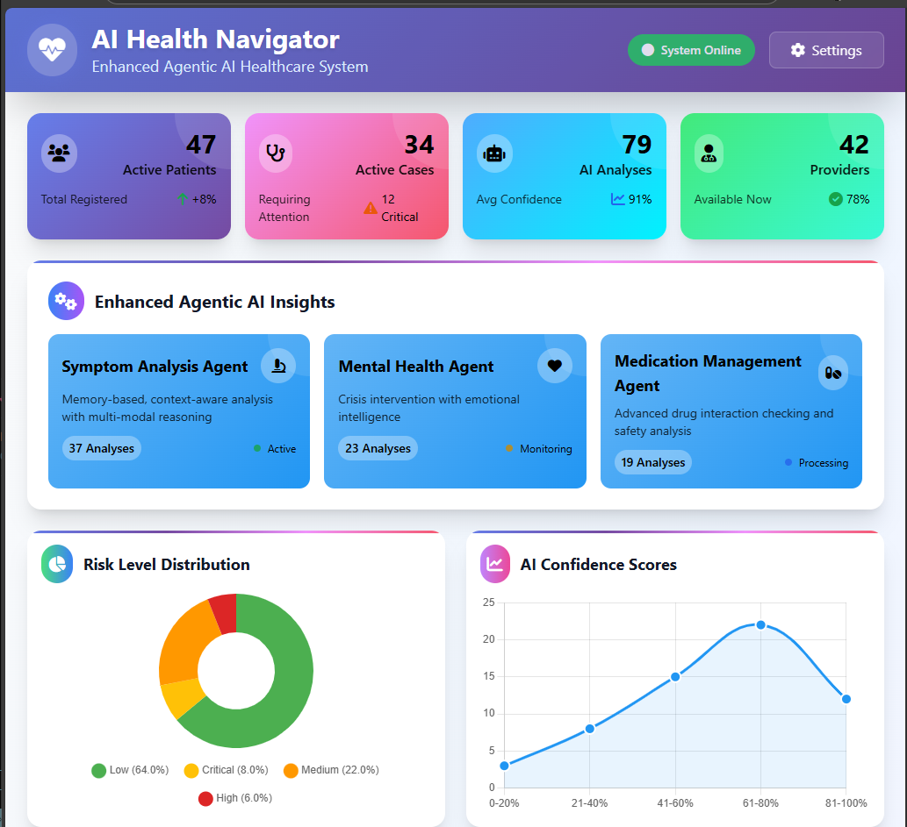
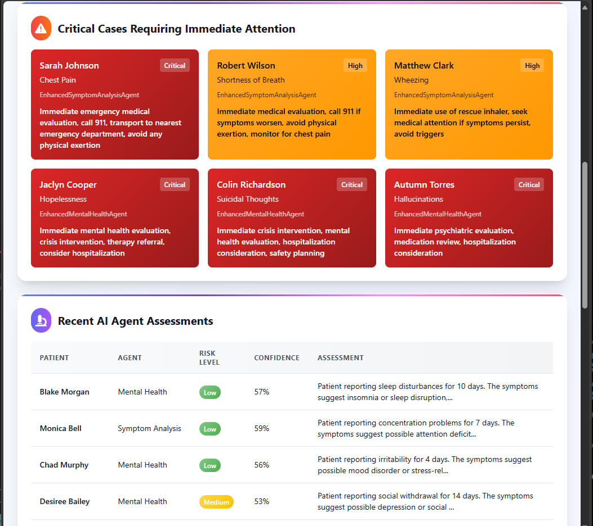
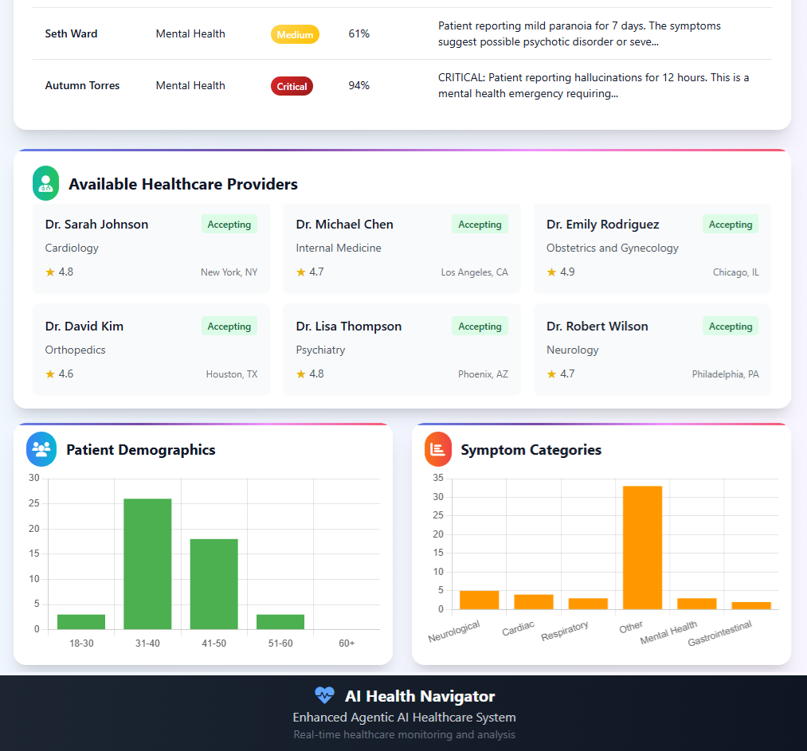

# 🏥 AI Health Navigator

**Advanced AI-powered health navigation platform with intelligent triage, provider matching, and personalized care recommendations**

[](https://www.python.org/downloads/)
[](https://fastapi.tiangolo.com/)
[](https://reactjs.org/)
[](https://www.typescriptlang.org/)
[](https://www.docker.com/)
[](LICENSE)

## 🚀 Overview

AI Health Navigator is a comprehensive healthcare platform that leverages cutting-edge AI technology to provide intelligent symptom analysis, emergency triage, healthcare provider matching, and personalized health recommendations. Built with enterprise-grade architecture, it offers a secure, scalable, and user-friendly solution for modern healthcare navigation.

## 📸 Screenshots

<div align="center">
  
  <p><em>Main Dashboard - Real-time health monitoring and AI agent insights</em></p>
  
  
  <p><em>Symptom Analysis - Advanced AI-powered health assessment</em></p>
  
  
  <p><em>Provider Matching - Intelligent healthcare provider recommendations</em></p>
</div>

## ✨ Advanced Features

### 🧠 **Multi-Modal AI Analysis**
- **Transformer Models**: Advanced NLP for symptom understanding
- **Traditional ML**: Ensemble models for condition classification
- **Semantic Analysis**: Deep understanding of medical terminology
- **Confidence Scoring**: Reliable assessment with uncertainty quantification
- **Risk Assessment**: Comprehensive health risk evaluation

### 🤖 **Advanced LLM Integration**
- **Multi-Provider Support**: OpenAI GPT-4, Anthropic Claude, and more
- **Healthcare-Specific Prompts**: Medical knowledge-optimized interactions
- **Context-Aware Analysis**: Patient history and context consideration
- **Real-time Processing**: Fast, accurate health assessments

### 🏥 **Healthcare Intelligence**
- **ICD-10 Mapping**: Standard medical condition classification
- **Drug Interaction Checking**: Comprehensive medication safety
- **Provider Matching**: Intelligent healthcare provider recommendations
- **Insurance Integration**: Coverage and cost optimization
- **Emergency Triage**: Critical care prioritization

### 🏗️ **Enterprise Architecture**
- **Microservices**: Scalable, maintainable service architecture
- **Event-Driven**: Real-time health monitoring and alerts
- **API-First**: Comprehensive RESTful API with OpenAPI documentation
- **Security-First**: HIPAA-compliant design with advanced security measures
- **Monitoring**: Comprehensive observability and health monitoring

## 🧠 **Enhanced Agentic AI System**

### **Advanced Memory Systems**
- **Episodic Memory**: Remembers past user interactions and medical experiences
- **Semantic Memory**: Stores medical knowledge, rules, and diagnostic criteria
- **Procedural Memory**: Learns and improves procedures over time
- **Short-term Memory**: Maintains context during active sessions
- **Long-term Memory**: Preserves important patterns and insights

### **Multi-Modal Reasoning Capabilities**
- **Deductive Reasoning**: Applies medical rules to symptoms
- **Inductive Reasoning**: Identifies patterns in user data
- **Abductive Reasoning**: Finds best explanations for symptoms
- **Analogical Reasoning**: Uses similar cases for comparison
- **Critical Reasoning**: Evaluates evidence and assumptions

### **Autonomous Decision-Making**
- **Goal Setting**: Automatically identifies healthcare goals
- **Planning**: Creates execution plans for achieving goals
- **Decision Making**: Makes autonomous decisions with configurable autonomy levels
- **Learning**: Continuously learns from experiences
- **Adaptation**: Adapts behavior based on changing circumstances

### **Cross-Agent Collaboration**
- **Memory Sharing**: Agents share relevant memories and insights
- **Reasoning Sharing**: Collaborative reasoning chains
- **Consensus Building**: Multiple agents reach agreement on complex decisions
- **Adaptive Coordination**: Dynamic workflow management

### **Enhanced Agents**
- **EnhancedSymptomAnalysisAgent**: Memory-based, context-aware symptom analysis
- **EnhancedMedicationManagementAgent**: Advanced drug interaction and safety analysis
- **EnhancedPreventiveCareAgent**: Predictive health planning and screening
- **EnhancedMentalHealthAgent**: Crisis intervention with emotional intelligence
- **EnhancedTriageAssessmentAgent**: Autonomous emergency assessment
- **EnhancedProviderMatchingAgent**: Intelligent provider matching with learning
- **EnhancedHealthCoachAgent**: Adaptive health coaching and wellness guidance
- **EnhancedEmergencyResponseAgent**: Coordinated emergency response

### **Enhanced Agent Orchestrator**
- **Collaborative Workflows**: Multi-agent collaboration with memory sharing
- **Consensus Building**: Intelligent agreement among multiple agents
- **Adaptive Execution**: Dynamic workflow management based on context
- **Cross-Agent Learning**: Knowledge transfer between agents
- **Performance Optimization**: Continuous improvement through learning
- **Comprehensive Assessment**: Multi-agent workflows for complete health evaluation

## 🏗️ Architecture Overview

```
┌─────────────────┐    ┌─────────────────┐    ┌─────────────────┐
│   Frontend      │    │   Backend API   │    │   AI Models     │
│   (React/TS)    │◄──►│   (FastAPI)     │◄──►│   (PyTorch)     │
└─────────────────┘    └─────────────────┘    └─────────────────┘
         │                       │                       │
         │              ┌─────────────────┐              │
         │              │   AI Agents     │              │
         │              │   (Orchestrator)│              │
         │              └─────────────────┘              │
         │                       │                       │
┌─────────────────┐    ┌─────────────────┐    ┌─────────────────┐
│   PostgreSQL    │    │     Redis       │    │   ChromaDB      │
│   (Primary DB)  │    │   (Cache/Queue) │    │  (Vector Store) │
└─────────────────┘    └─────────────────┘    └─────────────────┘
```

## 🛠️ Technology Stack

### **Backend & AI**
- **FastAPI**: High-performance async web framework
- **SQLAlchemy**: Advanced ORM with async support
- **Pydantic**: Data validation and settings management
- **PyTorch**: Deep learning and AI model framework
- **Transformers**: State-of-the-art NLP models
- **Celery**: Distributed task queue for background processing
- **Redis**: Caching, session management, and rate limiting
- **ChromaDB**: Vector database for semantic search

### **Frontend**
- **React 18**: Modern UI framework with hooks
- **TypeScript**: Type-safe JavaScript development
- **Vite**: Fast build tool and development server
- **Mantine UI**: Beautiful, accessible component library
- **React Query**: Server state management
- **React Router**: Client-side routing
- **Zustand**: Lightweight state management
- **Axios**: HTTP client for API communication
- **React Hook Form**: Form handling with validation
- **Zod**: Schema validation
- **Tabler Icons**: Beautiful icon library
- **Recharts**: Data visualization
- **Framer Motion**: Smooth animations
- **PWA**: Progressive Web App capabilities
- **Storybook**: Component development and testing
- **TailwindCSS**: Utility-first CSS framework

### **Infrastructure**
- **Docker**: Containerization and deployment
- **Docker Compose**: Multi-service orchestration
- **Kubernetes**: Production deployment (ready)
- **Nginx**: Reverse proxy and load balancing
- **Prometheus**: Metrics collection and monitoring
- **Grafana**: Visualization and alerting
- **ELK Stack**: Log aggregation and analysis
- **Sentry**: Error tracking and monitoring

### **Security & Compliance**
- **JWT Authentication**: Secure token-based auth
- **OAuth2**: Standard authorization protocol
- **RBAC**: Role-based access control
- **Data Encryption**: At rest and in transit
- **Rate Limiting**: API protection
- **Threat Detection**: Suspicious pattern monitoring
- **Security Headers**: Comprehensive security policies
- **Audit Logging**: Complete activity tracking
- **HIPAA Compliance**: Healthcare data protection

### **Development & Quality**
- **Pytest**: Comprehensive testing framework
- **Black**: Code formatting
- **isort**: Import sorting
- **flake8**: Linting
- **mypy**: Type checking
- **pre-commit**: Git hooks for quality
- **Coverage**: Test coverage reporting
- **Vitest**: Frontend testing
- **ESLint**: JavaScript/TypeScript linting
- **Prettier**: Code formatting

## 📁 Project Structure

```
AI-Health-Navigator-for-Patients/
├── 📄 README.md                    # Main project documentation
├── 📄 USE-CASES.md                 # Comprehensive use cases and user stories
├── 📄 .gitignore                   # Git ignore patterns
├── 📄 docker-compose.yml           # Full application orchestration
├── 📄 Makefile                     # Development commands and shortcuts
├── 📁 backend/                     # Backend application
│   ├── 📁 ai_health_navigator/     # Main Python package
│   │   ├── 📁 ai/                  # AI and machine learning
│   │   │   ├── 📁 agents/          # AI agents and orchestrator
│   │   │   │   ├── 📄 base_agent.py
│   │   │   │   ├── 📄 symptom_agent.py
│   │   │   │   ├── 📄 medication_agent.py
│   │   │   │   ├── 📄 preventive_care_agent.py
│   │   │   │   ├── 📄 mental_health_agent.py
│   │   │   │   ├── 📄 triage_agent.py
│   │   │   │   ├── 📄 provider_agent.py
│   │   │   │   ├── 📄 health_coach_agent.py
│   │   │   │   ├── 📄 emergency_agent.py
│   │   │   │   └── 📄 agent_orchestrator.py
│   │   │   ├── 📄 models.py        # AI model definitions
│   │   │   └── 📄 llm_service.py   # LLM integration
│   │   ├── 📁 api/                 # API layer
│   │   │   ├── 📁 routes/          # API endpoints
│   │   │   │   ├── 📄 symptoms.py
│   │   │   │   ├── 📄 triage.py
│   │   │   │   ├── 📄 providers.py
│   │   │   │   ├── 📄 insurance.py
│   │   │   │   ├── 📄 auth.py
│   │   │   │   ├── 📄 health.py
│   │   │   │   └── 📄 agents.py
│   │   │   ├── 📄 main.py          # FastAPI application
│   │   │   └── 📄 middleware.py    # Custom middleware
│   │   ├── 📁 core/                # Core functionality
│   │   │   ├── 📄 config.py        # Configuration management
│   │   │   ├── 📄 logging.py       # Structured logging
│   │   │   └── 📄 security.py      # Authentication & security
│   │   ├── 📁 database/            # Data layer
│   │   │   ├── 📄 models.py        # SQLAlchemy models
│   │   │   ├── 📄 session.py       # Database session management
│   │   │   └── 📄 repositories.py  # Data access layer
│   │   └── 📄 cli.py               # Command-line interface
│   ├── 📁 tests/                   # Test suite
│   │   ├── 📄 conftest.py          # Pytest configuration
│   │   ├── 📄 test_api.py          # API tests
│   │   └── 📄 test_ai_models.py    # AI model tests
│   ├── 📁 scripts/                 # Utility scripts
│   │   ├── 📄 setup_database.py    # Database initialization
│   │   └── 📄 load_medical_data.py # Medical data loading
│   ├── 📁 migrations/              # Database migrations
│   │   ├── 📄 alembic.ini          # Alembic configuration
│   │   └── 📄 env.py               # Migration environment
│   ├── 📁 config/                  # Configuration management
│   │   ├── 📄 settings.py          # Environment settings
│   │   └── 📄 environment.py       # Environment detection
│   ├── 📄 main.py                  # Application entry point
│   ├── 📄 requirements.txt         # Python dependencies
│   ├── 📄 pyproject.toml           # Project configuration
│   ├── 📄 Dockerfile               # Backend container
│   └── 📄 README.md                # Backend documentation
├── 📁 frontend/                    # React frontend application
│   ├── 📁 src/                     # Source code
│   │   ├── 📁 components/          # React components
│   │   │   ├── 📄 Layout.tsx
│   │   │   ├── 📄 NavigationItem.tsx
│   │   │   ├── 📄 LoadingScreen.tsx
│   │   │   └── 📄 NotificationsMenu.tsx
│   │   ├── 📁 contexts/            # React contexts
│   │   │   └── 📄 AuthContext.tsx
│   │   ├── 📁 hooks/               # Custom hooks
│   │   │   └── 📄 useAuth.ts
│   │   ├── 📁 services/            # API services
│   │   │   └── 📄 api.ts
│   │   ├── 📁 styles/              # Styling
│   │   │   └── 📄 theme.ts
│   │   ├── 📁 types/               # TypeScript types
│   │   │   └── 📄 index.ts
│   │   ├── 📄 App.tsx              # Main application component
│   │   └── 📄 main.tsx             # Application entry point
│   ├── 📄 package.json             # Node.js dependencies
│   ├── 📄 vite.config.ts           # Vite configuration
│   ├── 📄 tsconfig.json            # TypeScript configuration
│   ├── 📄 Dockerfile               # Frontend container
│   └── 📄 nginx.conf               # Nginx configuration
└── 📁 monitoring/                  # Monitoring and observability
    ├── 📄 prometheus.yml           # Prometheus configuration
    └── 📁 grafana/                 # Grafana dashboards
        ├── 📁 dashboards/
        │   ├── 📄 ai-health-navigator.json
        │   └── 📄 dashboard.yml
        └── 📁 datasources/
            └── 📄 prometheus.yml
```

## 🚀 Quick Start

### **Prerequisites**
- Python 3.9+
- Node.js 18+
- Docker & Docker Compose
- PostgreSQL 15+
- Redis 7+

### **Development Setup**

1. **Clone the repository**
   ```bash
   git clone https://github.com/your-org/ai-health-navigator.git
   cd ai-health-navigator
   ```

2. **Install dependencies**
   ```bash
   make install
   ```

3. **Setup development environment**
   ```bash
   make setup-dev
   ```

4. **Run the application**
   ```bash
   make run
   ```

### **Docker Setup**

1. **Build and start all services**
   ```bash
   make docker-up
   ```

2. **View logs**
   ```bash
   make docker-logs
   ```

3. **Stop services**
   ```bash
   make docker-down
   ```

### **Access the Application**

- **Frontend**: http://localhost:3000
- **Backend API**: http://localhost:8000
- **API Documentation**: http://localhost:8000/docs
- **Grafana Dashboard**: http://localhost:3001 (admin/admin)
- **Prometheus**: http://localhost:9090
- **Kibana**: http://localhost:5601

## 📚 API Documentation

### **Core Endpoints**
- **Health Check**: `GET /health`
- **API Documentation**: `GET /docs` (Swagger UI)
- **Metrics**: `GET /metrics` (Prometheus)

### **Symptom Analysis**
- **Analyze Symptoms**: `POST /api/v1/symptoms/analyze`
- **Batch Analysis**: `POST /api/v1/symptoms/batch`
- **History**: `GET /api/v1/symptoms/history/{user_id}`

### **Triage Assessment**
- **Emergency Triage**: `POST /api/v1/triage/assess`
- **Triage History**: `GET /api/v1/triage/history/{user_id}`

### **Provider Management**
- **Search Providers**: `GET /api/v1/providers/search`
- **Provider Details**: `GET /api/v1/providers/{provider_id}`

### **Agent Management**
- **Agent Stats**: `GET /api/v1/agents/stats`
- **Execute Workflow**: `POST /api/v1/agents/execute`
- **Agent Health**: `GET /api/v1/agents/health`
- **Comprehensive Assessment**: `POST /api/v1/agents/comprehensive-assessment`
- **Agent Capabilities**: `GET /api/v1/agents/capabilities`
- **Workflow History**: `GET /api/v1/agents/workflow-history`

### **Enhanced Agentic AI**
- **Collaborative Workflow**: `POST /api/v1/enhanced-agents/execute-collaborative-workflow`
- **Advanced Symptom Analysis**: `POST /api/v1/enhanced-agents/advanced-symptom-analysis`
- **Capability Demonstration**: `POST /api/v1/enhanced-agents/demonstrate-agentic-capabilities`
- **Enhanced Agent Stats**: `GET /api/v1/enhanced-agents/stats`
- **Collaboration Insights**: `GET /api/v1/enhanced-agents/collaboration-insights`
- **Enhanced Capabilities**: `GET /api/v1/enhanced-agents/capabilities`
- **Enhanced Health**: `GET /api/v1/enhanced-agents/health`
- **Collaboration History**: `GET /api/v1/enhanced-agents/collaboration-history`

### **Authentication**
- **Register**: `POST /api/v1/auth/register`
- **Login**: `POST /api/v1/auth/login`
- **Profile**: `GET /api/v1/auth/me`
- **Logout**: `POST /api/v1/auth/logout`

## 🤖 Enhanced AI Agents Usage

### **Enhanced Symptom Analysis with Memory and Reasoning**
```python
from ai_health_navigator.ai.agents.enhanced_symptom_agent import EnhancedSymptomAnalysisAgent
from ai_health_navigator.ai.agents.enhanced_base_agent import AgentContext, AgentPriority

# Initialize enhanced agent with memory systems
agent = EnhancedSymptomAnalysisAgent()
await agent.initialize()

# Execute with advanced capabilities
result = await agent.execute(
    context=AgentContext(
        user_id="user123",
        session_id="session456",
        request_id="req789",
        timestamp=datetime.utcnow(),
        metadata={"autonomy_level": 0.8},
        priority=AgentPriority.HIGH
    ),
    symptoms=["chest pain", "shortness of breath"],
    severity="severe",
    duration="2 hours",
    enable_memory_integration=True,
    enable_autonomous_decisions=True
)
```

### **Collaborative Multi-Agent Workflow**
```python
from ai_health_navigator.ai.agents.enhanced_agent_orchestrator import (
    EnhancedAgentOrchestrator, WorkflowType, CollaborationType
)

# Initialize enhanced orchestrator
orchestrator = EnhancedAgentOrchestrator()
await orchestrator.initialize()

# Execute collaborative workflow
result = await orchestrator.execute_collaborative_workflow(
    workflow_id="comprehensive_assessment_123",
    workflow_type=WorkflowType.COMPREHENSIVE,
    context=context,
    parameters={
        "symptoms": ["chest pain", "fatigue"],
        "severity": "moderate",
        "enable_memory_sharing": True,
        "enable_reasoning_sharing": True
    },
    collaboration_type=CollaborationType.COLLABORATIVE
)
```

### **Advanced API Usage**
```python
import requests

# Execute collaborative workflow via API
response = requests.post(
    "http://localhost:8000/api/v1/enhanced-agents/execute-collaborative-workflow",
    json={
        "user_id": "user123",
        "session_id": "session456",
        "workflow_type": "comprehensive",
        "parameters": {
            "symptoms": ["chest pain", "shortness of breath"],
            "severity": "severe",
            "duration": "2 hours"
        },
        "enable_memory_sharing": True,
        "enable_reasoning_sharing": True,
        "autonomy_level": 0.8
    }
)

# Get collaboration insights
insights = requests.get(
    "http://localhost:8000/api/v1/enhanced-agents/collaboration-insights"
)
```

### **Mental Health Agent**
```python
from ai_health_navigator.ai.agents import MentalHealthAgent

agent = MentalHealthAgent()
await agent.initialize()
result = await agent.run(
    context=context,
    symptoms=["sadness", "hopelessness", "fatigue"],
    mood_assessment={"depression_level": 8, "suicidal_thoughts": False},
    current_stressors=["work_stress", "relationship_issues"]
)
```

## 🧪 Testing

### **Run all tests**
```bash
make test
```

### **Run backend tests only**
```bash
make test-backend
```

### **Run frontend tests only**
```bash
make test-frontend
```

### **Run with coverage**
```bash
cd backend && python -m pytest tests/ --cov=ai_health_navigator --cov-report=html
```

## 🔧 Development

### **Code Quality**
```bash
# Format code
make format

# Lint code
make lint

# Type checking
cd backend && mypy ai_health_navigator/
```

### **Database Management**
```bash
# Run migrations
make db-migrate

# Reset database
make db-reset

# Load sample data
make db-seed
```

### **Monitoring**
```bash
# Start monitoring services
make monitoring

# View logs
make logs
```

## 🚀 Deployment

### **Production Deployment**
```bash
# Build production images
docker-compose -f docker-compose.prod.yml build

# Deploy to production
docker-compose -f docker-compose.prod.yml up -d
```

### **Kubernetes Deployment**
```bash
# Apply Kubernetes manifests
kubectl apply -f k8s/

# Check deployment status
kubectl get pods -n ai-health-navigator
```

## 📊 Monitoring & Observability

### **Metrics**
- **Application Metrics**: Request rates, response times, error rates
- **AI Model Metrics**: Prediction accuracy, model performance
- **Agent Metrics**: Agent health, execution times, success rates
- **System Metrics**: CPU, memory, disk usage

### **Logging**
- **Structured Logging**: JSON-formatted logs with correlation IDs
- **Log Aggregation**: Centralized log collection with ELK stack
- **Error Tracking**: Real-time error monitoring with Sentry

### **Alerting**
- **Health Checks**: Automated health monitoring
- **Performance Alerts**: Response time and throughput alerts
- **Error Alerts**: Critical error notifications
- **Security Alerts**: Suspicious activity detection

## 🔒 Security & Compliance

### **Data Protection**
- **Encryption**: AES-256 encryption for data at rest and in transit
- **Access Control**: Role-based access control (RBAC)
- **Audit Logging**: Complete audit trail for all actions
- **Data Masking**: Sensitive data protection

### **HIPAA Compliance**
- **Privacy Controls**: Patient data privacy protection
- **Security Measures**: Comprehensive security controls
- **Compliance Monitoring**: Regular compliance audits
- **Incident Response**: Security incident handling procedures

### **API Security**
- **Rate Limiting**: Protection against abuse
- **Input Validation**: Comprehensive input sanitization
- **CORS Configuration**: Cross-origin resource sharing controls
- **Security Headers**: HTTP security headers

## 🤝 Contributing

1. Fork the repository
2. Create a feature branch (`git checkout -b feature/amazing-feature`)
3. Commit your changes (`git commit -m 'Add amazing feature'`)
4. Push to the branch (`git push origin feature/amazing-feature`)
5. Open a Pull Request

### **Development Guidelines**
- Follow the existing code style
- Add tests for new features
- Update documentation
- Ensure all tests pass
- Follow security best practices

## 📄 License

This project is licensed under the MIT License - see the [LICENSE](LICENSE) file for details.

## 🙏 Acknowledgments

- **Medical Knowledge**: Based on established medical guidelines and best practices
- **AI Research**: Leveraging state-of-the-art AI and machine learning research
- **Open Source**: Built with amazing open-source tools and libraries
- **Community**: Thanks to the healthcare and AI communities for inspiration and support

---

**Built with ❤️ for better healthcare navigation**
